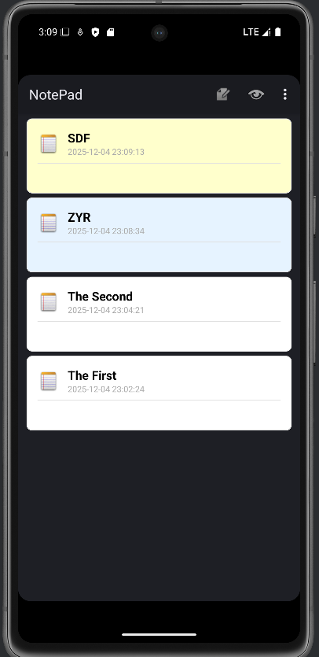
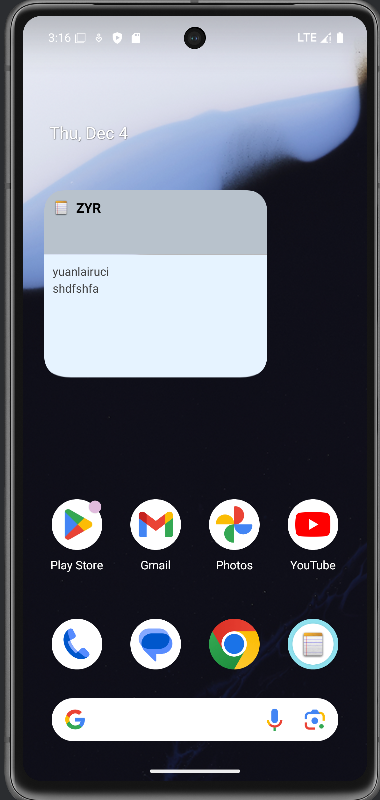
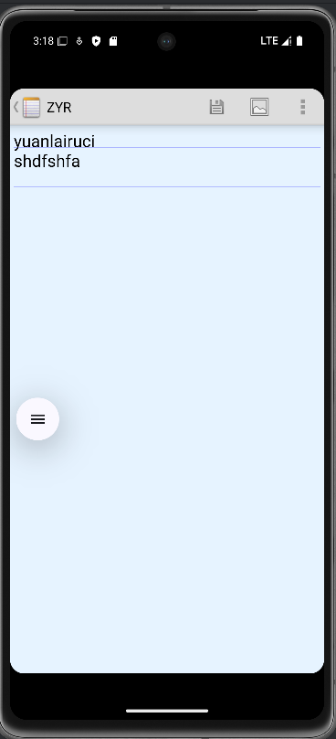
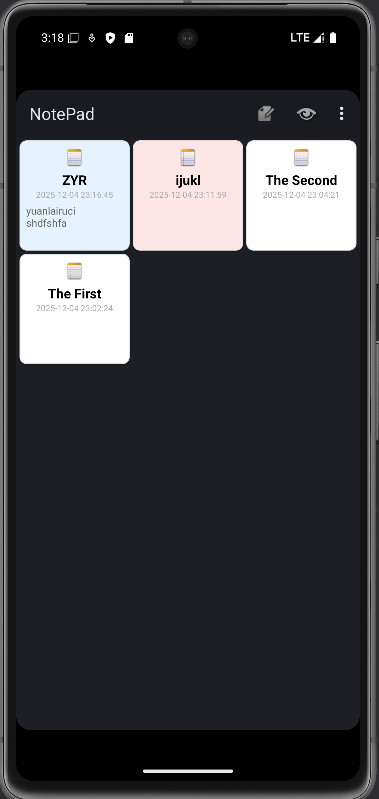
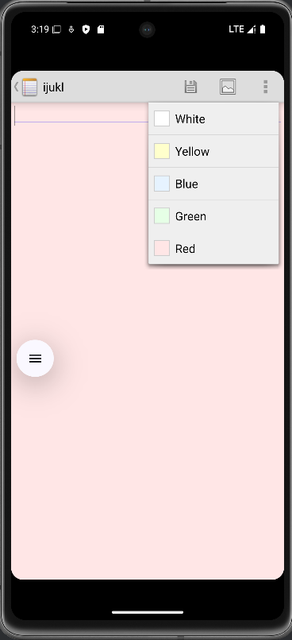

# Android 记事本应用

一款多功能记事本工具，具备笔记管理能力，搭配简洁易用的交互设计与丰富的个性化功能，满足日常记录与整理需求。

## 功能特点

- 📝 **笔记管理**：支持笔记的创建、编辑、查看与删除操作，流程清晰高效
- 🎨 **颜色主题**：内置多种配色方案，可根据喜好自定义笔记背景色，提升视觉体验
- 📱 **小部件支持**：支持将常用笔记添加至手机主屏幕，实现一键快速访问
- 📂 **实时文件夹**：兼容系统实时文件夹功能，便捷管理笔记文件
- 📋 **列表/网格视图**：提供列表视图与网格视图切换，适配不同使用习惯
- 🔍 **搜索功能**：支持笔记内容关键词检索，快速定位目标笔记
- 💾 **数据持久化**：基于 ContentProvider 组件封装数据操作，通过 SQLite 实现安全存储

## 技术栈

- **开发语言**：Java
- **开发框架**：Android SDK
- **数据存储**：SQLite 数据库 + ContentProvider 组件
- **UI组件**：Android原生UI组件
- **构建工具**：Gradle

## 应用截图

### 笔记列表界面


### 笔记编辑界面


### 颜色主题选择


### 小部件配置


### 应用主界面


## 安装方法

### 使用Android Studio安装

1. 通过 Git 克隆仓库或直接下载项目压缩包至本地目录
2. 启动 Android Studio，选择「Open an existing project」选项
3. 浏览并选中已下载的项目根目录
4. 等待 Gradle 自动同步项目依赖
5. 连接Android设备或启动自带模拟器
6. 点击工具栏「Run」按钮，完成应用安装

### 使用APK安装

1. 构建项目生成APK文件
2. 将APK文件传输到Android设备
3. 在设备上安装APK文件

## 项目结构

```
NotePad/
├── app/
│   ├── src/
│   │   ├── main/
│   │   │   ├── AndroidManifest.xml    # 应用配置文件
│   │   │   ├── java/com/example/android/notepad/    # Java源代码
│   │   │   │   ├── NoteEditor.java    # 笔记编辑活动
│   │   │   │   ├── NotePad.java       # 应用常量定义
│   │   │   │   ├── NotePadProvider.java    # 内容提供者
│   │   │   │   ├── NoteWidgetConfigureActivity.java    # 小部件配置活动
│   │   │   │   ├── NoteWidgetProvider.java    # 小部件提供者
│   │   │   │   ├── NotesList.java      # 笔记列表活动
│   │   │   │   ├── NotesLiveFolder.java    # 实时文件夹
│   │   │   │   ├── SquareLayout.java   # 自定义布局
│   │   │   │   └── TitleEditor.java    # 标题编辑活动
│   │   │   ├── res/                   # 资源文件
│   │   │   │   ├── drawable/          # 图片和可绘制资源
│   │   │   │   ├── layout/            # 布局文件
│   │   │   │   ├── menu/              # 菜单文件
│   │   │   │   ├── values/            # 字符串、颜色等资源
│   │   │   │   └── xml/               # XML配置文件
├── build.gradle                       # 项目构建配置
├── gradle/                            # Gradle包装器
└── settings.gradle                    # 项目设置
```

## 核心功能说明

### 笔记列表管理

NotesList.java作为应用入口主界面，承担所有笔记的展示与管理功能，支持列表 / 网格视图切换、新增笔记触发、笔记搜索筛选等核心交互，通过 ContentProvider 获取并展示笔记数据。
### 笔记编辑

NoteEditor.java和TitleEditor.java负责笔记内容与标题的编辑工作，提供多行文本输入、文本状态保存、颜色主题切换等功能，编辑内容实时通过 ContentProvider 同步至数据库，确保数据不丢失。

### 数据管理

NotePadProvider.java基于 Android ContentProvider 组件封装 SQLite 数据库操作，提供增删改查（CRUD）标准化接口，统一管理笔记数据（标题、内容、创建时间、修改时间、背景色等），保证数据访问的安全性与一致性。

### 小部件功能

NoteWidgetProvider.java和NoteWidgetConfigureActivity.java实现 Android 桌面小部件功能，支持用户选择指定笔记添加至主屏幕，通过小部件可快速查看笔记内容；配置活动提供小部件尺寸、显示笔记选择等个性化设置。

## 快速使用说指南
1. **创建新笔记**：在笔记列表页的菜单选项中点击「新建」按钮，进入编辑界面输入内容即可完成创建
2. **编辑笔记**：在列表页点击任意笔记条目，直接进入编辑界面修改内容，退出时自动保存
3. **删除笔记**：长按目标笔记，在弹出的上下文菜单中选择「删除」选项，确认后即可移除
4. **切换颜色主题**：在笔记编辑界面，通过菜单中的「颜色选择」选项，挑选心仪的背景色
5. **添加桌面小部件**：在手机主屏幕长按空白区域，选择「小部件」选项，找到「记事本」小部件并添加，按需配置显示的笔记内容

## 系统兼容性

兼容 Android 4.0（API Level 14）及更高系统版本，适配手机、平板等多种 Android 设备屏幕尺寸。

## 许可证

本项目基于 Apache License 2.0 开源许可证进行分发，详细许可条款可查阅项目根目录下的 LICENSE 文件。

## 贡献

欢迎通过 Issue 提交功能建议或 Bug 反馈，也可直接提交 Pull Request 参与代码优化。所有贡献需遵循 Apache License 2.0 开源协议，确保代码的可复用性与兼容性。

---
