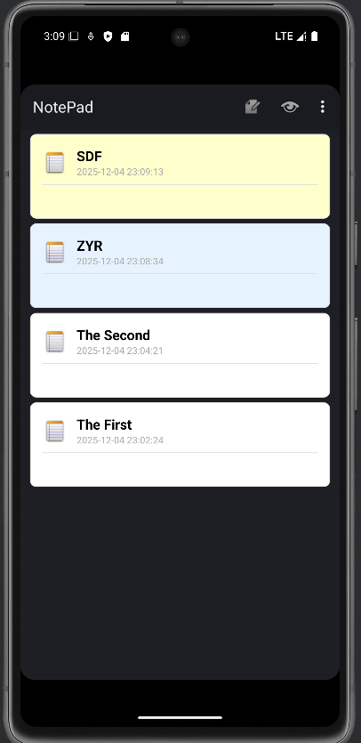
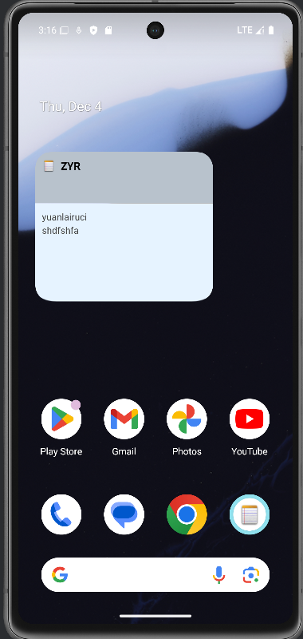
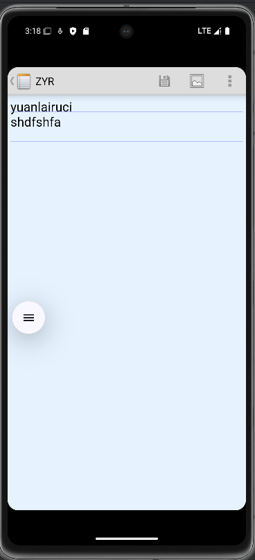
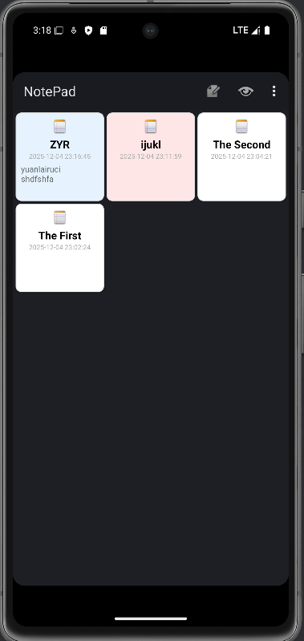
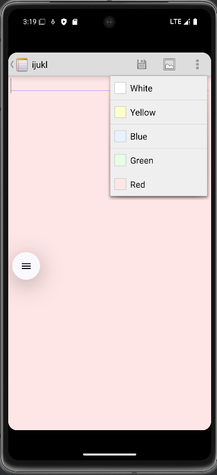

# Android 记事本应用

一个功能完整的Android记事本应用，支持笔记的创建、编辑、删除和管理，提供简洁直观的用户界面和丰富的功能特性。

## 功能特点

- 📝 **笔记管理**：创建、编辑、删除和查看笔记
- 🎨 **颜色主题**：支持多种颜色主题，个性化笔记显示
- 📱 **小部件支持**：将笔记添加到主屏幕，快速访问
- 📂 **实时文件夹**：支持Android实时文件夹功能
- 📋 **列表/网格视图**：支持多种笔记展示方式
- 🔍 **搜索功能**：快速查找笔记内容
- 💾 **数据持久化**：使用ContentProvider进行数据管理

## 技术栈

- **开发语言**：Java
- **开发框架**：Android SDK
- **数据存储**：SQLite (通过ContentProvider)
- **UI组件**：Android原生UI组件
- **构建工具**：Gradle

## 应用截图

### 笔记列表界面


### 笔记编辑界面


### 颜色主题选择


### 小部件配置


### 应用主界面


## 安装方法

### 使用Android Studio安装

1. 克隆或下载本项目到本地
2. 打开Android Studio，选择"Open an existing project"
3. 选择项目目录
4. 等待Gradle同步完成
5. 连接Android设备或启动模拟器
6. 点击"Run"按钮安装应用

### 使用APK安装

1. 构建项目生成APK文件
2. 将APK文件传输到Android设备
3. 在设备上安装APK文件

## 核心功能实现

### 1. 增删改查功能

#### 文件位置
[NotePadProvider.java](app/src/main/java/com/example/android/notepad/NotePadProvider.java) - 数据操作核心实现
[NotesList.java](app/src/main/java/com/example/android/notepad/NotesList.java) - 列表操作界面
[NoteEditor.java](app/src/main/java/com/example/android/notepad/NoteEditor.java) - 编辑操作界面

#### 核心代码片段

```java
// 1. 新增笔记 (NotesList.java)
private void addNote() {
    // 准备新笔记数据
    ContentValues values = new ContentValues();
    long now = System.currentTimeMillis();
    values.put(NotePad.Notes.COLUMN_NAME_TITLE, "");
    values.put(NotePad.Notes.COLUMN_NAME_NOTE, "");
    values.put(NotePad.Notes.COLUMN_NAME_MODIFICATION_DATE, now);
    values.put(NotePad.Notes.COLUMN_NAME_BACK_COLOR, Color.rgb(255, 255, 255));
    
    // 插入数据到ContentProvider
    Uri newUri = getContentResolver().insert(NotePad.Notes.CONTENT_URI, values);
    if (newUri != null) {
        // 跳转到编辑界面
        Intent intent = new Intent(this, NoteEditor.class);
        intent.setAction(Intent.ACTION_EDIT);
        intent.setData(newUri);
        startActivity(intent);
    }
}

// 2. 查询笔记 (NotePadProvider.java)
@Override
public Cursor query(Uri uri, String[] projection, String selection, String[] selectionArgs, String sortOrder) {
    SQLiteQueryBuilder qb = new SQLiteQueryBuilder();
    qb.setTables(NotePad.Notes.TABLE_NAME);
    
    // 根据URI模式选择不同的查询策略
    switch (sUriMatcher.match(uri)) {
        case NOTES: // 查询所有笔记
            qb.setProjectionMap(sNotesProjectionMap);
            break;
        case NOTE_ID: // 查询单条笔记
            qb.setProjectionMap(sNotesProjectionMap);
            // 添加ID筛选条件
            qb.appendWhere(NotePad.Notes._ID + "=" + 
                uri.getPathSegments().get(NotePad.Notes.NOTE_ID_PATH_POSITION));
            break;
        default:
            throw new IllegalArgumentException("Unknown URI " + uri);
    }
    
    // 执行查询
    SQLiteDatabase db = mOpenHelper.getReadableDatabase();
    Cursor c = qb.query(db, projection, selection, selectionArgs, null, null, 
        TextUtils.isEmpty(sortOrder) ? NotePad.Notes.DEFAULT_SORT_ORDER : sortOrder);
    
    // 通知数据变更观察者
    c.setNotificationUri(getContext().getContentResolver(), uri);
    return c;
}

// 3. 更新笔记 (NoteEditor.java)
private final void updateNote(String text, String title) {
    ContentValues values = new ContentValues();
    // 更新修改时间
    values.put(NotePad.Notes.COLUMN_NAME_MODIFICATION_DATE, System.currentTimeMillis());
    
    // 设置标题和内容
    values.put(NotePad.Notes.COLUMN_NAME_TITLE, title);
    values.put(NotePad.Notes.COLUMN_NAME_NOTE, text);
    
    // 执行更新操作
    getContentResolver().update(mUri, values, null, null);
}

// 4. 删除笔记 (NoteEditor.java)
private final void deleteNote() {
    if (mCursor != null) {
        mCursor.close();
        mCursor = null;
        // 执行删除操作
        getContentResolver().delete(mUri, null, null);
        mText.setText("");
        // 更新小部件
        updateWidget();
    }
}
```

### 2. 修改主题颜色

#### 文件位置
[NoteEditor.java](app/src/main/java/com/example/android/notepad/NoteEditor.java)

#### 核心代码片段

```java
// 颜色主题切换功能
private void updateColor(int color) {
    // 更新编辑区背景颜色
    mText.setBackgroundColor(color);
    
    // 准备更新数据
    ContentValues values = new ContentValues();
    // 保存颜色值到数据库
    values.put(NotePad.Notes.COLUMN_NAME_BACK_COLOR, color);
    
    // 执行更新操作
    getContentResolver().update(mUri, values, null, null);
    
    // 更新小部件显示
    updateWidget();
}

// 菜单项点击处理
@Override
public boolean onOptionsItemSelected(MenuItem item) {
    int id = item.getItemId();
    // 根据选择的颜色菜单项更新主题
    if (id == R.id.menu_color_white) {
        updateColor(getResources().getColor(R.color.note_color_white));
        return true;
    } else if (id == R.id.menu_color_yellow) {
        updateColor(getResources().getColor(R.color.note_color_yellow));
        return true;
    } else if (id == R.id.menu_color_blue) {
        updateColor(getResources().getColor(R.color.note_color_blue));
        return true;
    } else if (id == R.id.menu_color_green) {
        updateColor(getResources().getColor(R.color.note_color_green));
        return true;
    } else if (id == R.id.menu_color_red) {
        updateColor(getResources().getColor(R.color.note_color_red));
        return true;
    }
    return super.onOptionsItemSelected(item);
}
```

### 3. 小部件支持添加到主屏幕

#### 文件位置
[NoteWidgetProvider.java](app/src/main/java/com/example/android/notepad/NoteWidgetProvider.java) - 小部件实现
[NoteWidgetConfigureActivity.java](app/src/main/java/com/example/android/notepad/NoteWidgetConfigureActivity.java) - 小部件配置

#### 核心代码片段

```java
// 小部件更新逻辑 (NoteWidgetProvider.java)
static void updateAppWidget(Context context, AppWidgetManager appWidgetManager, int appWidgetId) {
    // 从偏好设置获取绑定的笔记ID
    long noteId = NoteWidgetConfigureActivity.loadNoteIdPref(context, appWidgetId);
    if (noteId == -1) return;
    
    // 查询笔记数据
    Uri noteUri = android.content.ContentUris.withAppendedId(NotePad.Notes.CONTENT_URI, noteId);
    Cursor cursor = context.getContentResolver().query(
            noteUri,
            new String[] { NotePad.Notes.COLUMN_NAME_TITLE, NotePad.Notes.COLUMN_NAME_NOTE, NotePad.Notes.COLUMN_NAME_BACK_COLOR },
            null, null, null
    );
    
    // 处理查询结果
    String title = "";
    String text = "";
    int color = Color.WHITE;
    if (cursor != null) {
        if (cursor.moveToFirst()) {
            title = cursor.getString(cursor.getColumnIndexOrThrow(NotePad.Notes.COLUMN_NAME_TITLE));
            text = cursor.getString(cursor.getColumnIndexOrThrow(NotePad.Notes.COLUMN_NAME_NOTE));
            color = cursor.getInt(cursor.getColumnIndexOrThrow(NotePad.Notes.COLUMN_NAME_BACK_COLOR));
        }
        cursor.close();
    }
    
    // 创建RemoteViews用于更新小部件UI
    RemoteViews views = new RemoteViews(context.getPackageName(), R.layout.widget_note);
    views.setTextViewText(R.id.widget_title, title);
    views.setTextViewText(R.id.widget_text, text);
    
    // 设置小部件背景颜色
    int darkerColor = darkenColor(color);
    views.setImageViewBitmap(R.id.widget_header_bg, createRoundedBitmap(darkerColor, true, false));
    views.setImageViewBitmap(R.id.widget_content_bg, createRoundedBitmap(color, false, true));
    
    // 设置点击事件，跳转到编辑界面
    Intent intent = new Intent(context, NoteEditor.class);
    intent.setAction(Intent.ACTION_EDIT);
    intent.setData(noteUri);
    PendingIntent pendingIntent = PendingIntent.getActivity(context, 0, intent, 
            PendingIntent.FLAG_UPDATE_CURRENT | PendingIntent.FLAG_IMMUTABLE);
    views.setOnClickPendingIntent(R.id.widget_layout, pendingIntent);
    
    // 更新小部件
    appWidgetManager.updateAppWidget(appWidgetId, views);
}

// 小部件配置 (NoteWidgetConfigureActivity.java)
@Override
protected void onCreate(Bundle icicle) {
    super.onCreate(icicle);
    // 设置结果为取消，防止用户按返回键时添加空小部件
    setResult(RESULT_CANCELED);
    
    // 加载笔记列表布局
    setContentView(R.layout.notes_list_view);
    mListView = (ListView) findViewById(android.R.id.list);
    
    // 查询所有笔记用于选择
    Cursor cursor = getContentResolver().query(
            NotePad.Notes.CONTENT_URI,
            new String[] { NotePad.Notes._ID, NotePad.Notes.COLUMN_NAME_TITLE, 
                           NotePad.Notes.COLUMN_NAME_NOTE, NotePad.Notes.COLUMN_NAME_MODIFICATION_DATE, 
                           NotePad.Notes.COLUMN_NAME_BACK_COLOR },
            null, null, NotePad.Notes.DEFAULT_SORT_ORDER
    );
    
    // 设置适配器显示笔记列表
    SimpleCursorAdapter adapter = new SimpleCursorAdapter(
            this, R.layout.noteslist_item, cursor, 
            new String[] { NotePad.Notes.COLUMN_NAME_TITLE, NotePad.Notes.COLUMN_NAME_NOTE, 
                          NotePad.Notes.COLUMN_NAME_MODIFICATION_DATE, NotePad.Notes.COLUMN_NAME_BACK_COLOR },
            new int[] { R.id.title, R.id.text, R.id.modified, R.id.back_color }, 0);
    mListView.setAdapter(adapter);
    
    // 列表项点击事件处理
    mListView.setOnItemClickListener(new AdapterView.OnItemClickListener() {
        @Override
        public void onItemClick(AdapterView<?> parent, View view, int position, long id) {
            // 保存选择的笔记ID
            saveNoteIdPref(NoteWidgetConfigureActivity.this, mAppWidgetId, id);
            
            // 更新小部件
            AppWidgetManager appWidgetManager = AppWidgetManager.getInstance(NoteWidgetConfigureActivity.this);
            NoteWidgetProvider.updateAppWidget(NoteWidgetConfigureActivity.this, appWidgetManager, mAppWidgetId);
            
            // 设置结果为成功并返回
            Intent resultValue = new Intent();
            resultValue.putExtra(AppWidgetManager.EXTRA_APPWIDGET_ID, mAppWidgetId);
            setResult(RESULT_OK, resultValue);
            finish();
        }
    });
}
```

### 4. 实时文件夹

#### 文件位置
[NotesLiveFolder.java](app/src/main/java/com/example/android/notepad/NotesLiveFolder.java)

#### 核心代码片段

```java
public class NotesLiveFolder extends Activity {
    @Override
    protected void onCreate(Bundle savedInstanceState) {
        super.onCreate(savedInstanceState);
        
        final Intent intent = getIntent();
        final String action = intent.getAction();
        
        // 处理创建实时文件夹的请求
        if (LiveFolders.ACTION_CREATE_LIVE_FOLDER.equals(action)) {
            // 创建实时文件夹配置Intent
            final Intent liveFolderIntent = new Intent();
            
            // 设置实时文件夹的数据URI
            liveFolderIntent.setData(NotePad.Notes.LIVE_FOLDER_URI);
            
            // 设置实时文件夹名称
            String foldername = getString(R.string.live_folder_name);
            liveFolderIntent.putExtra(LiveFolders.EXTRA_LIVE_FOLDER_NAME, foldername);
            
            // 设置实时文件夹图标
            ShortcutIconResource foldericon = 
                Intent.ShortcutIconResource.fromContext(this, R.drawable.live_folder_notes);
            liveFolderIntent.putExtra(LiveFolders.EXTRA_LIVE_FOLDER_ICON, foldericon);
            
            // 设置实时文件夹显示模式为列表
            liveFolderIntent.putExtra(
                    LiveFolders.EXTRA_LIVE_FOLDER_DISPLAY_MODE,
                    LiveFolders.DISPLAY_MODE_LIST);
            
            // 设置点击实时文件夹项的默认动作：编辑笔记
            Intent returnIntent = new Intent(Intent.ACTION_EDIT, NotePad.Notes.CONTENT_ID_URI_PATTERN);
            liveFolderIntent.putExtra(LiveFolders.EXTRA_LIVE_FOLDER_BASE_INTENT, returnIntent);
            
            // 返回成功结果
            setResult(RESULT_OK, liveFolderIntent);
        } else {
            // 不支持的动作，返回取消结果
            setResult(RESULT_CANCELED);
        }
        
        // 结束Activity
        finish();
    }
}
```

### 5. 笔记有时间戳

#### 文件位置
[NotePadProvider.java](app/src/main/java/com/example/android/notepad/NotePadProvider.java) - 时间戳自动管理
[NotesList.java](app/src/main/java/com/example/android/notepad/NotesList.java) - 时间戳显示

#### 核心代码片段

```java
// 时间戳自动管理 (NotePadProvider.java)
@Override
public Uri insert(Uri uri, ContentValues initialValues) {
    // 验证URI
    if (sUriMatcher.match(uri) != NOTES) {
        throw new IllegalArgumentException("Unknown URI " + uri);
    }
    
    ContentValues values = initialValues != null ? new ContentValues(initialValues) : new ContentValues();
    
    // 获取当前时间戳
    Long now = System.currentTimeMillis();
    
    // 如果没有提供创建时间，自动添加
    if (!values.containsKey(NotePad.Notes.COLUMN_NAME_CREATE_DATE)) {
        values.put(NotePad.Notes.COLUMN_NAME_CREATE_DATE, now);
    }
    
    // 如果没有提供修改时间，自动添加
    if (!values.containsKey(NotePad.Notes.COLUMN_NAME_MODIFICATION_DATE)) {
        values.put(NotePad.Notes.COLUMN_NAME_MODIFICATION_DATE, now);
    }
    
    // 执行插入操作
    SQLiteDatabase db = mOpenHelper.getWritableDatabase();
    long rowId = db.insert(NotePad.Notes.TABLE_NAME, NotePad.Notes.COLUMN_NAME_NOTE, values);
    
    // 处理插入结果
    if (rowId > 0) {
        Uri noteUri = ContentUris.withAppendedId(NotePad.Notes.CONTENT_ID_URI_BASE, rowId);
        getContext().getContentResolver().notifyChange(noteUri, null);
        return noteUri;
    }
    
    throw new SQLException("Failed to insert row into " + uri);
}

// 时间戳格式化显示 (NotesList.java)
private final SimpleCursorAdapter.ViewBinder mViewBinder = new SimpleCursorAdapter.ViewBinder() {
    @Override
    public boolean setViewValue(View view, Cursor cursor, int columnIndex) {
        if (view.getId() == R.id.modified) {
            // 获取时间戳
            long millis = 0;
            try {
                millis = cursor.getLong(columnIndex);
            } catch (Exception e) {
                // 处理异常
            }
            
            if (millis > 0) {
                // 格式化时间戳为友好显示格式
                SimpleDateFormat sdf = new SimpleDateFormat("yyyy-MM-dd HH:mm:ss", Locale.getDefault());
                sdf.setTimeZone(TimeZone.getTimeZone("Asia/Shanghai"));
                String formatted = sdf.format(new Date(millis));
                ((TextView) view).setText(formatted);
            } else {
                ((TextView) view).setText("");
            }
            return true;
        }
        // 其他字段处理...
        return false;
    }
};
```

### 6. 支持列表或网格视图

#### 文件位置
[NotesList.java](app/src/main/java/com/example/android/notepad/NotesList.java)

#### 核心代码片段

```java
public class NotesList extends ListActivity implements LoaderManager.LoaderCallbacks<Cursor> {
    private SimpleCursorAdapter mAdapter; // 列表视图适配器
    private SimpleCursorAdapter mGridAdapter; // 网格视图适配器
    private GridView mGridView;
    private boolean isGridView = false; // 当前视图模式标记
    
    @Override
    protected void onCreate(Bundle savedInstanceState) {
        super.onCreate(savedInstanceState);
        setContentView(R.layout.notes_list_view);
        
        // 初始化列表适配器
        setupListAdapter(null);
        // 初始化网格适配器
        setupGridAdapter(null);
        
        // 获取网格视图并设置适配器
        mGridView = (GridView) findViewById(R.id.grid);
        mGridView.setAdapter(mGridAdapter);
        
        // 设置网格项点击事件
        mGridView.setOnItemClickListener(new AdapterView.OnItemClickListener() {
            @Override
            public void onItemClick(AdapterView<?> parent, View view, int position, long id) {
                // 跳转到编辑界面
                Intent intent = new Intent(NotesList.this, NoteEditor.class);
                intent.setAction(Intent.ACTION_EDIT);
                intent.setData(android.content.ContentUris.withAppendedId(NotePad.Notes.CONTENT_URI, id));
                startActivity(intent);
            }
        });
        
        // 设置列表视图分隔线为透明
        ListView listView = getListView();
        listView.setDivider(null);
        listView.setDividerHeight(0);
        
        // 加载笔记数据
        loadNotes();
    }
    
    // 切换视图模式
    private void toggleView() {
        isGridView = !isGridView;
        if (isGridView) {
            // 显示网格视图，隐藏列表视图
            getListView().setVisibility(View.GONE);
            mGridView.setVisibility(View.VISIBLE);
        } else {
            // 显示列表视图，隐藏网格视图
            getListView().setVisibility(View.VISIBLE);
            mGridView.setVisibility(View.GONE);
        }
    }
    
    // 处理菜单项点击
    @Override
    public boolean onOptionsItemSelected(MenuItem item) {
        int id = item.getItemId();
        if (id == R.id.menu_switch_view) {
            // 切换视图模式
            toggleView();
            return true;
        }
        // 其他菜单处理...
        return super.onOptionsItemSelected(item);
    }
}
```

### 7. 搜索功能

#### 文件位置
[NotesList.java](app/src/main/java/com/example/android/notepad/NotesList.java)

#### 核心代码片段

```java
// 搜索笔记
private void searchNotes(String query) {
    setTitle(getString(R.string.search_title) + ": " + query);
    
    // 准备搜索参数
    Bundle args = new Bundle();
    args.putString(LOADER_ARG_QUERY, query);
    
    // 重新启动Loader执行搜索
    getLoaderManager().restartLoader(NOTES_LIST_LOADER_ID, args, this);
}

// 创建搜索对话框
private void showSearchDialog() {
    AlertDialog.Builder builder = new AlertDialog.Builder(this);
    builder.setTitle(R.string.menu_search);
    
    // 创建搜索输入框
    final EditText input = new EditText(this);
    input.setHint(R.string.search_hint);
    builder.setView(input);
    
    // 设置确定按钮点击事件
    builder.setPositiveButton(android.R.string.ok, new DialogInterface.OnClickListener() {
        @Override
        public void onClick(DialogInterface dialog, int which) {
            String query = input.getText().toString().trim();
            if (!query.isEmpty()) {
                // 执行搜索
                searchNotes(query);
            }
        }
    });
    
    // 设置取消按钮点击事件
    builder.setNegativeButton(android.R.string.cancel, new DialogInterface.OnClickListener() {
        @Override
        public void onClick(DialogInterface dialog, int which) {
            dialog.cancel();
        }
    });
    
    // 显示搜索对话框
    builder.show();
}

// Loader创建方法
@Override
public Loader<Cursor> onCreateLoader(int id, Bundle args) {
    String selection = null;
    String[] selectionArgs = null;
    String query = null;
    
    if (id == NOTES_LIST_LOADER_ID) {
        // 检查是否有搜索参数
        if (args != null && args.containsKey(LOADER_ARG_QUERY)) {
            query = args.getString(LOADER_ARG_QUERY);
        }
        
        // 如果有搜索参数，构建搜索条件
        if (query != null && !query.isEmpty()) {
            // 在标题或内容中搜索匹配文本
            selection = NotePad.Notes.COLUMN_NAME_TITLE + " LIKE ? OR " +
                    NotePad.Notes.COLUMN_NAME_NOTE + " LIKE ?";
            selectionArgs = new String[] { "%" + query + "%", "%" + query + "%" };
        }
        
        // 创建并返回CursorLoader
        return new CursorLoader(
                this,
                NotePad.Notes.CONTENT_URI,
                PROJECTION,
                selection,
                selectionArgs,
                NotePad.Notes.DEFAULT_SORT_ORDER
        );
    }
    return null;
}
```

### 8. 数据持久化

#### 文件位置
[NotePadProvider.java](app/src/main/java/com/example/android/notepad/NotePadProvider.java) - ContentProvider实现

#### 核心代码片段

```java
public class NotePadProvider extends ContentProvider implements PipeDataWriter<Cursor> {
    // 数据库名称和版本
    private static final String DATABASE_NAME = "note_pad.db";
    private static final int DATABASE_VERSION = 3;
    
    // 数据库助手类
    static class DatabaseHelper extends SQLiteOpenHelper {
        DatabaseHelper(Context context) {
            super(context, DATABASE_NAME, null, DATABASE_VERSION);
        }
        
        // 创建数据库表
        @Override
        public void onCreate(SQLiteDatabase db) {
            db.execSQL("CREATE TABLE " + NotePad.Notes.TABLE_NAME + " ("
                    + NotePad.Notes._ID + " INTEGER PRIMARY KEY,"
                    + NotePad.Notes.COLUMN_NAME_TITLE + " TEXT,"
                    + NotePad.Notes.COLUMN_NAME_NOTE + " TEXT,"
                    + NotePad.Notes.COLUMN_NAME_CREATE_DATE + " INTEGER,"
                    + NotePad.Notes.COLUMN_NAME_MODIFICATION_DATE + " INTEGER,"
                    + NotePad.Notes.COLUMN_NAME_BACK_COLOR + " INTEGER"
                    + ");");
        }
        
        // 数据库升级处理
        @Override
        public void onUpgrade(SQLiteDatabase db, int oldVersion, int newVersion) {
            // 简单的升级策略：删除旧表并重新创建
            Log.w(TAG, "Upgrading database from version " + oldVersion + " to "
                    + newVersion + ", which will destroy all old data");
            db.execSQL("DROP TABLE IF EXISTS notes");
            onCreate(db);
        }
    }
    
    // ContentProvider初始化
    @Override
    public boolean onCreate() {
        // 创建数据库助手实例
        mOpenHelper = new DatabaseHelper(getContext());
        return true;
    }
    
    // 插入操作
    @Override
    public Uri insert(Uri uri, ContentValues initialValues) {
        // 验证URI
        if (sUriMatcher.match(uri) != NOTES) {
            throw new IllegalArgumentException("Unknown URI " + uri);
        }
        
        // 准备插入数据
        ContentValues values = initialValues != null ? new ContentValues(initialValues) : new ContentValues();
        Long now = System.currentTimeMillis();
        
        // 设置默认值
        if (!values.containsKey(NotePad.Notes.COLUMN_NAME_CREATE_DATE)) {
            values.put(NotePad.Notes.COLUMN_NAME_CREATE_DATE, now);
        }
        if (!values.containsKey(NotePad.Notes.COLUMN_NAME_MODIFICATION_DATE)) {
            values.put(NotePad.Notes.COLUMN_NAME_MODIFICATION_DATE, now);
        }
        if (!values.containsKey(NotePad.Notes.COLUMN_NAME_TITLE)) {
            Resources r = Resources.getSystem();
            values.put(NotePad.Notes.COLUMN_NAME_TITLE, r.getString(android.R.string.untitled));
        }
        if (!values.containsKey(NotePad.Notes.COLUMN_NAME_NOTE)) {
            values.put(NotePad.Notes.COLUMN_NAME_NOTE, "");
        }
        if (!values.containsKey(NotePad.Notes.COLUMN_NAME_BACK_COLOR)) {
            values.put(NotePad.Notes.COLUMN_NAME_BACK_COLOR, Color.rgb(255, 255, 255));
        }
        
        // 执行插入操作
        SQLiteDatabase db = mOpenHelper.getWritableDatabase();
        long rowId = db.insert(NotePad.Notes.TABLE_NAME, NotePad.Notes.COLUMN_NAME_NOTE, values);
        
        // 处理插入结果
        if (rowId > 0) {
            Uri noteUri = ContentUris.withAppendedId(NotePad.Notes.CONTENT_ID_URI_BASE, rowId);
            // 通知数据变更
            getContext().getContentResolver().notifyChange(noteUri, null);
            return noteUri;
        }
        
        throw new SQLException("Failed to insert row into " + uri);
    }
    
    // 其他ContentProvider方法：query、update、delete等...
}
```

## 项目结构

```
NotePad/
├── app/
│   ├── src/
│   │   ├── main/
│   │   │   ├── AndroidManifest.xml    # 应用配置文件
│   │   │   ├── java/com/example/android/notepad/    # Java源代码
│   │   │   │   ├── NoteEditor.java    # 笔记编辑活动
│   │   │   │   ├── NotePad.java       # 应用常量定义
│   │   │   │   ├── NotePadProvider.java    # 内容提供者
│   │   │   │   ├── NoteWidgetConfigureActivity.java    # 小部件配置活动
│   │   │   │   ├── NoteWidgetProvider.java    # 小部件提供者
│   │   │   │   ├── NotesList.java      # 笔记列表活动
│   │   │   │   ├── NotesLiveFolder.java    # 实时文件夹
│   │   │   │   ├── SquareLayout.java   # 自定义布局
│   │   │   │   └── TitleEditor.java    # 标题编辑活动
│   │   │   ├── res/                   # 资源文件
│   │   │   │   ├── drawable/          # 图片和可绘制资源
│   │   │   │   ├── layout/            # 布局文件
│   │   │   │   ├── menu/              # 菜单文件
│   │   │   │   ├── values/            # 字符串、颜色等资源
│   │   │   │   └── xml/               # XML配置文件
├── build.gradle                       # 项目构建配置
├── gradle/                            # Gradle包装器
└── settings.gradle                    # 项目设置
```

## 兼容性

支持Android 4.0 (API Level 14)及以上版本。

## 许可证

本项目采用Apache License 2.0许可证，详见LICENSE文件。

## 贡献

欢迎提交Issue和Pull Request来帮助改进这个项目！

---

如果您对这个项目有任何问题或建议，请随时联系我。
